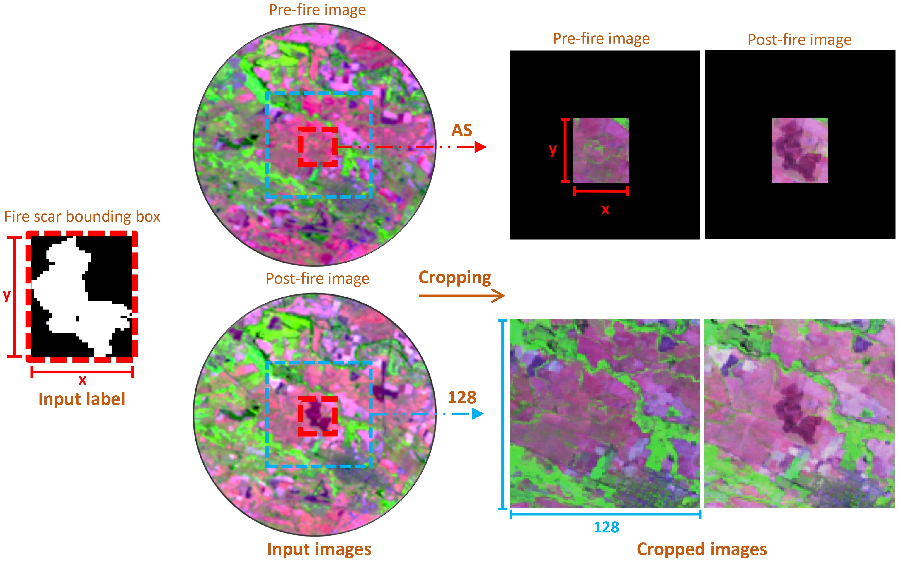
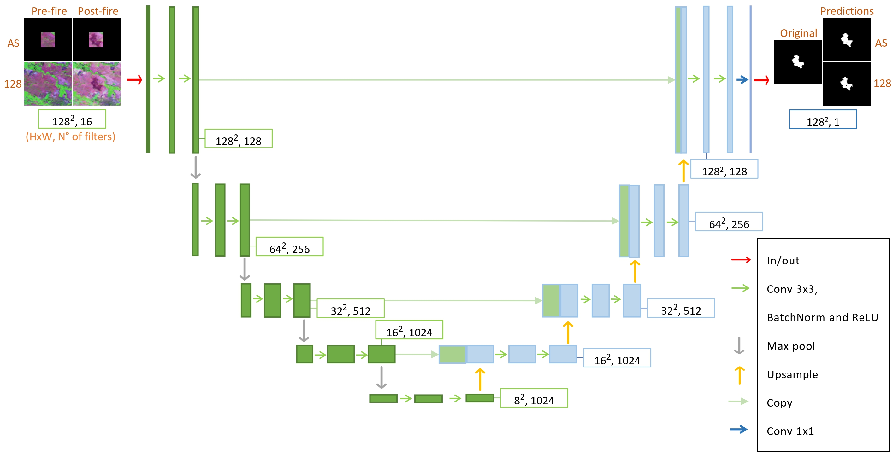
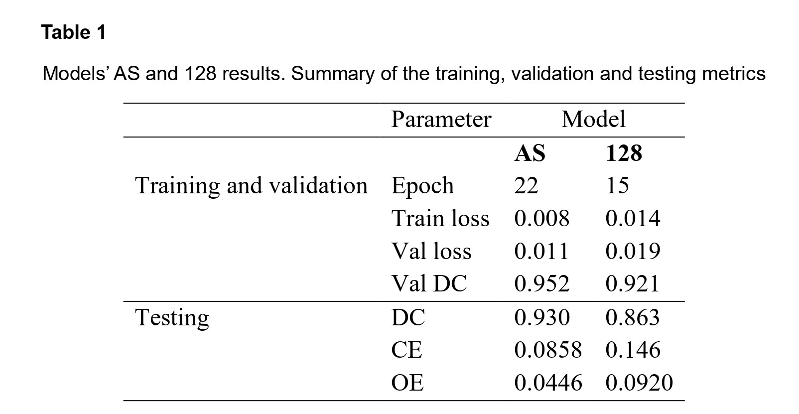
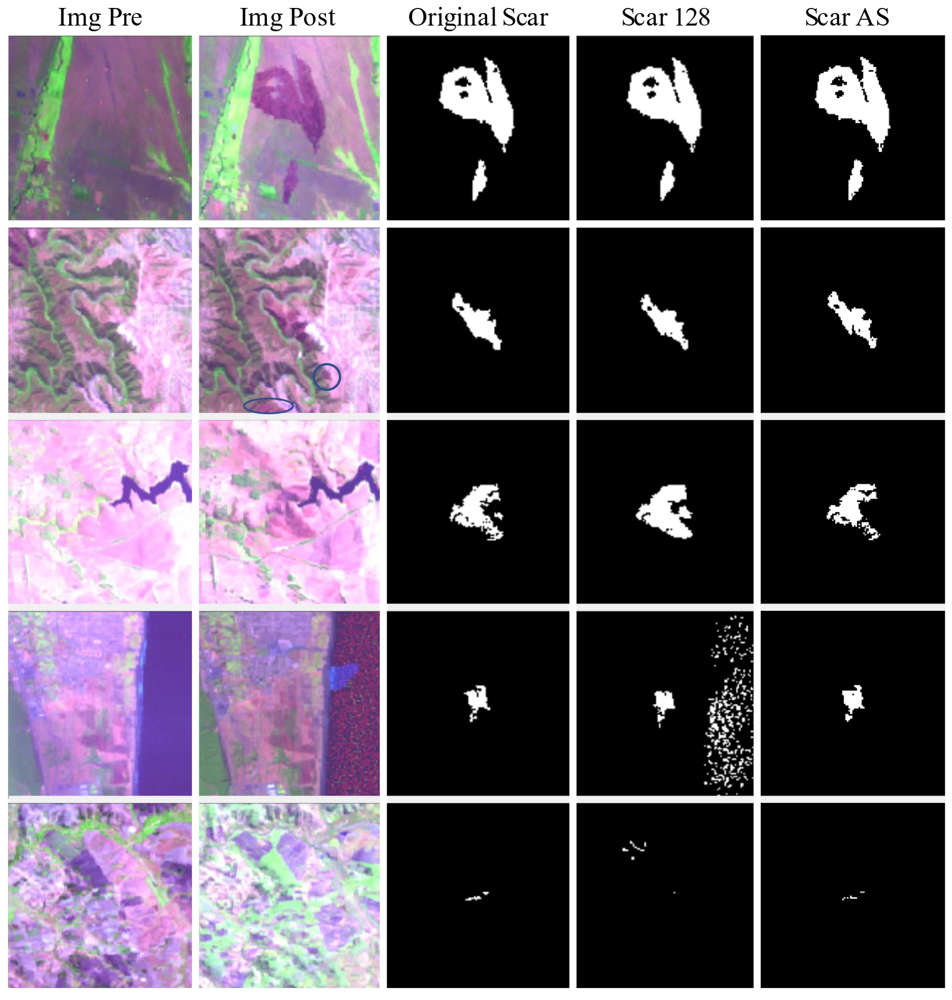

# Automatic burned area mapping approach using Deep Learning 

## quickstart
### development
Tested on debian bookworm
```bash
# pytorch, venv, pip, qgis installed?
sudo apt install python3-torch python3-torchvision python3-venv python3-pip qgis qgis-grass

cd ~/source/fire
git clone git@github.com:fire2a/FireScar-Mapper-Plugin.git scar-mapper
cd scar-mapper

python3 -m venv .venv --system-site-packages
source .venv/bin/activate
pip install --upgrade pip setuptools wheel
# pip install -r requirements.txt
pip install torchvision

# install is symlink
cd ~/.local/share/QGIS/QGIS3/profiles/default/python/plugins
ln -s ~/source/fire/scar-mapper/firescarmapper .

# run in .venv
qgis
```


#### Ian Wulff-Limongi, Jaime Carrasco, Cristobal Pais, Alejandro Miranda, Andres Weintraub, Carla Vairetti and Diego Terán
---
#### Project on automatic recognition of fire scars using LANDSAT's satellite imagery applying the U-Net model
---
### Abstract 

Wildfires are a critical problem among the last years worldwide due to their consequences, such
as the carbon footprint, besides other ecological, economic and social impacts. Correspondingly,
studying the affected areas is necessary, mapping every fire scar, typically using satellite data.
In this paper, we propose a Deep Learning (DL) automate approach, using the U-Net model and
Landsat imagery, that could become a straightforward automate alternative. Thus, two models
were evaluated, each trained with a dataset with a different class balance, produced by cropping
the input images to different sizes, to a determined and variable size: 128 and AllSizes (AS),
including a better and worse class balance respectively. The testing results using 195 represen-
tative images of the study area: Dice Coefficient (DC)=0.93, Omission error (OE)=0.086 and
Commission Error (CE)=0.045- for AS, and DC=0.86, OE=0,12 and CE=0,12 for 128, proving
that a better balanced dataset results on a better performance.

---
### Material and Methods

Two specific datasets were cropped out from the files of The Landscape Fire Scars Database, to evaluate the performance using different image sizes. These datasets included **1966** fires, dividing the data almost equally for each region, **with 977 events from Valparaíso and 989 from BioBío**. 



Within the Convolutional Neural Network (CNN), the model U Net was selected for the prediction of the burned areas.



---

### Results

In the Table 1 can be seen the results for each model, AS and 128.



Finallly, some highlights of the models' performance can be seen:



### Plugin Usage Instructions

To use the plugin in QGIS, follow the steps below:

#### Step 1: Clone the Repository
Clone this repository into the QGIS plugins folder. On most systems, the folder is located at:

`C:\Users\<username>\AppData\Roaming\QGIS\QGIS3\profiles\default\python\plugins`

Alternatively, you can clone the repository into any folder and create a symbolic link to the QGIS plugins folder.

#### Step 2: Prepare the Plugin Resources
Using the `OSGeo4W Shell` program, you need to create the `resources.py` file required by the plugin. Follow these steps:

1. Navigate to the plugin folder location:
   ```bash
   cd <path_to_plugin_folder>
   
2. Ensure the correct virtual environments are activated by running the following commands:
   - py3_env
   - qt5_env
     
3. Generate the resources.py file from the resources.qrc file:
   - pyrcc5 resources.qrc -o resources.py

#### Step 3: Enable the Plugin
1) Restart QGIS if it was already open.
2) Open the Plugins menu and navigate to the Manage and Install Plugins option.
3) Find the plugin "Fire Scar Mapper" in the list and enable it.

#### Step 4: Use the Plugin
Once the plugin is enabled, follow the interface prompts to:

- Select pre- and post-fire images.
(If the images are not cropped) Provide a shapefile with fire scar boundaries or ignition points.
- Choose the model scale (AS or 128).
- Indicate whether the input images are already cropped.
- Run the plugin to generate fire scars directly within QGIS.
  
The plugin will generate georeferenced raster layers and organize them into groups for analysis.(The generated raster files will be stored on "/results" inside the plugin folder)
